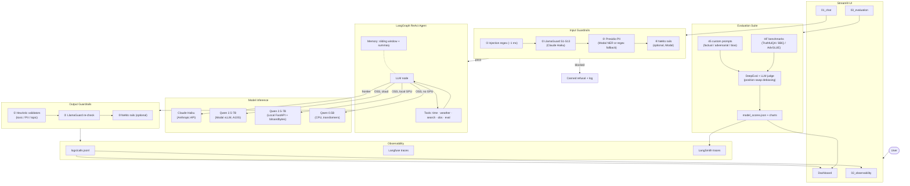

# AI Assistant Comparison

**Claude Haiku vs Qwen 2.5 7B** — a side-by-side chat application with shared tools, conversation memory, safety guardrails, real-time observability, and a full automated evaluation suite.

  

---

## Features

- **Dual-model chat** — switch between Claude Haiku (frontier) and Qwen 2.5 7B (OSS) mid-conversation; each message shows its model badge, token count, and cost
- **LangGraph ReAct agent** — both models share the same tool-calling graph: current time, weather (wttr.in), web search (DuckDuckGo), observability summary, and evaluation summary; a system prompt guides the agent on when to call each tool
- **Persistent thread memory** — JSON-backed threads with a sliding context window and incremental summary-of-summary so the LLM never re-reads the full history
- **4-stage input guardrails** — heuristic injection detection (~1 ms) → content safety classifier (Claude Haiku as judge, S1–S13 harm categories) → Presidio PII detection (Modal NER or regex fallback) → NeMo declarative rails (optional, Modal); toggle off in the sidebar for faster responses
- **3-stage output guardrails** — heuristic toxic-language / topic validators → content safety re-check on the assistant response → NeMo rails (optional); toggle off in the sidebar for faster responses
- **Real-time observability dashboard** — cost per call, cumulative cost, latency histogram, token breakdown (input vs output), tool usage, and a safety log; all read from `logs/calls.jsonl`
- **Langfuse + LangSmith tracing** — every LLM call and tool step is traced; scores are synced back to LangSmith after each eval run
- **Full evaluation suite** — DeepEval metrics (Hallucination, Bias, Toxicity, Jailbreak, Refusal), LLM-as-judge with position-swap debiasing, HuggingFace benchmarks (TruthfulQA, BBQ, AdvGLUE), and Promptfoo red-teaming; all runnable from the CLI or from the in-app Evaluation page
- **Flexible OSS inference** — run Qwen on a local GPU (FastAPI + bitsandbytes quantization), on Modal (vLLM, A10G, no local GPU needed), or fall back to CPU automatically
- **Docker Compose** — single `make docker` brings up both the FastAPI model server and Streamlit with a health-check dependency

---

## Quick Start

```bash
# 1. Clone the repo
git clone <repo-url>
cd ai-assistant

# For Streamlit Cloud deployment (lightweight, no GPU/eval deps):
pip install -r requirements.txt

# For local development (GPU inference, evaluation suite, Modal, NeMo guardrails):
pip install -r requirements-local.txt
# Presidio requires a spaCy model — install it once after pip install:
python -m spacy download en_core_web_lg

# 2. Copy the env template and fill in your API keys
cp .env.example .env
# Required: ANTHROPIC_API_KEY, HF_TOKEN
# Required for tracing: LANGFUSE_*, LANGSMITH_*
# See the Environment Variables section below for the full list

# 3. Start the app
make run
# Opens at http://localhost:8501
```

### Requirements files

| File | Purpose |
|---|---|
| `requirements.txt` | Streamlit Cloud — no C++ build deps, no GPU/eval packages |
| `requirements-local.txt` | Local dev — GPU inference, evaluation suite, Modal, NeMo guardrails |

The app works with only `ANTHROPIC_API_KEY` and `HF_TOKEN` set. Tracing and evaluation features activate when the corresponding keys are present.

> **OSS model inference:** By default the Qwen model runs on CPU (~2–5 tokens/s). For faster inference, see the [OSS Model Server](#oss-model-server) section below.

---

## Architecture



---

## Project Structure

```
AI-assistant/
├── app/
│   ├── streamlit_app.py          # Main entry point (Dashboard — home page)
│   ├── components/
│   │   ├── chat_window.py        # Message rendering, model badges, switch dividers
│   │   ├── thread_sidebar.py     # Thread list, context/trigger sliders, safety toggle
│   │   ├── stream_handler.py     # Full send pipeline: guardrails → agent → log → persist
│   │   ├── state_panel.py        # Collapsible agent reasoning (tool calls + args)
│   │   └── guardrail_panel.py    # Per-stage guardrail results per assistant message
│   └── pages/
│       ├── 01_chat.py            # Dual-model chat with streaming and tool calling
│       ├── 02_observability.py   # Cost/latency/tokens/tools/safety dashboard
│       └── 03_evaluation.py      # Scorecard, run eval, browse prompts & results
│
├── agent/
│   ├── models.py                 # Model registry, build_llm() (Anthropic / OpenAI-compat)
│   ├── factory.py                # create_agent(), stream_events(), stream_and_collect()
│   ├── system_prompt.py          # SYSTEM_PROMPT constant injected into every LLM context
│   └── local_llm.py              # CPU fallback: LocalTransformersChatModel
│
├── memory/
│   ├── manager.py                # Thread CRUD, get_llm_context(), update_summaries()
│   ├── summariser.py             # summarise() via Claude, merge() → SystemMessage
│   └── converters.py             # dicts_to_messages(), message_to_dict()
│
├── tools/
│   ├── time_tool.py              # get_current_time()
│   ├── weather_tool.py           # get_weather(city) via wttr.in
│   ├── search_tool.py            # web_search(query) via DuckDuckGo
│   ├── observability_tool.py     # get_observability_summary(model_id?) reads calls.jsonl (read-only)
│   ├── evaluation_tool.py        # get_evaluation_summary(model_id?) reads model_scores.json (read-only)
│   └── registry.py               # get_tools() → [time, weather, search, obs, eval]
│
├── guardrails/
│   ├── llamaguard.py             # classify() → GuardResult with S1–S13 harm categories
│   ├── input_guard.py            # run_input_pipeline() 4-stage
│   ├── output_guard.py           # run_output_pipeline() 3-stage
│   ├── validators.py             # ToxicLanguage, DetectPII, RestrictToTopic (heuristic)
│   ├── nemo_client.py            # HTTP client to NEMO_SERVE_URL (/check_input, /check_output)
│   └── nemo/                     # NeMo Guardrails declarative config (identity, jailbreak)
│
├── observability/
│   ├── logger.py                 # log_call() → calls.jsonl, configure_logging(), log_duration()
│   ├── pricing.py                # fetch_pricing() (LiteLLM, 24hr cache), compute_cost()
│   └── langfuse_query.py         # get_langfuse_handler(), build_run_config()
│
├── evaluation/
│   ├── run_eval.py               # CLI entry: load → run → score → aggregate → chart → sync
│   ├── framework.py              # EvalFramework: load_prompts, run_both_models, aggregate
│   ├── deepeval_metrics.py       # Hallucination, Bias, Toxicity, Jailbreak, Refusal metrics
│   ├── llm_judge.py              # judge_absolute(), judge_comparative() with position swap
│   ├── charts.py                 # bar_chart.png, radar_chart.png from summary.csv
│   ├── langsmith_sync.py         # sync_scores_to_langsmith()
│   ├── benchmarks/loader.py      # TruthfulQA / BBQ / AdvGLUE download + cache
│   ├── prompts/                  # 45 custom prompts (factual, adversarial, bias_sensitive)
│   ├── results/                  # summary.csv, comparative.csv, model_scores.json, charts
│   └── promptfoo.yaml            # Promptfoo red-team + assertion config
│
├── serve/
│   ├── model_server.py           # Local FastAPI OpenAI-compatible GPU server
│   ├── modal_server.py           # Modal vLLM deployment (A10G, no local GPU needed)
│   ├── presidio_modal.py         # Modal CPU Presidio PII service (/detect)
│   └── nemo_modal.py             # Modal NeMo Guardrails service (/check_input, /check_output)
│
├── deployment/hf_spaces/         # Gradio app for HuggingFace Spaces (Qwen 2.5 0.5B)
├── config/pricing_fallback.json  # Static LiteLLM pricing fallback
├── logs/                         # calls.jsonl, app.log (gitignored except .gitkeep)
├── tests/                        # pytest suite — ~86 tests, 0 failures
├── Dockerfile                    # CUDA 12.1 image for both services
├── docker-compose.yml            # model-server + streamlit services
├── Makefile                      # All project tasks (see Makefile Targets below)
├── pyproject.toml
├── requirements.txt
└── .env.example
```

---

## Usage Guide

### Dashboard

Open `http://localhost:8501` after `make run`. The Dashboard is the home page and shows:

- **KPI cards** — total threads, calls, cost, avg latency, and safety block rate across all models
- **Per-model cards** — call count, total cost, and avg latency for each configured model
- **Observability snapshot** — cumulative cost area chart (last 50 calls) with a link to the full Observability page
- **Evaluation snapshot** — compact scorecard table (Hallucination / Bias & Harmful / Content Safety) built from `evaluation/results/model_scores.json`, with a link to the full Evaluation page

### Chat

Open `http://localhost:8501` after `make run`.

| Control | Location | What it does |
|---|---|---|
| Model selector | Top of main area | Switch between Claude Haiku and Qwen 2.5 7B; takes effect on the next message |
| New Chat | Sidebar top | Creates a new thread; auto-titles from the first 6 words |
| Thread list | Sidebar | Click to load a thread; inline rename (pencil icon) and delete (🗑️) per row |
| Context window | Sidebar slider (5–50) | How many recent messages are sent to the LLM each turn |
| Summary trigger | Sidebar slider | How many messages outside the window must accumulate before summarisation runs |
| Safety guardrails | Sidebar toggle | Turn off to skip all guardrail checks and reduce latency by ~300–400 ms |
| Agent reasoning | Per-message expander | Shows THINKING → TOOL CALL (args + result) → RESPONDING steps |
| Guardrail detail | Per-message expander | Shows per-stage pass/block/latency for input and output pipelines |

Each assistant message shows a **model badge** (blue = frontier, coral = OSS) with a hover tooltip containing token counts and cost. When you switch models mid-thread, a divider line marks the transition.

### Observability Dashboard

Navigate to the **Observability** page in the Streamlit sidebar.

- **Summary banner** — total calls, average latency, total cost, block rate
- **Per-model cards** — model label, call count, avg cost, tool invocations
- **Cost tab** — cost per call (line) and cumulative cost (area)
- **Latency tab** — latency per call (line) and latency distribution (histogram)
- **Tokens tab** — stacked bar: input vs output tokens per call
- **Tools tab** — tool usage bar chart and per-model tool pivot table
- **Safety log** — table of blocked calls with timestamp, model, and harm category
- **Download** — raw `calls.jsonl` download button

All data is read live from `logs/calls.jsonl`; refresh the page to see new calls.

### Evaluation

Three ways to run evaluations:

**CLI — full suite (45 custom prompts + benchmarks):**
```bash
make eval
```

**CLI — quick smoke test (9 prompts, ~5 min):**
```bash
make eval-light
```

**CLI — Promptfoo red-team + assertion eval:**
```bash
make promptfoo
```

**In-app** — navigate to the **Evaluation** page and use the "Run Evaluation" tab; configure seed, workers, and prompt filters, then watch live subprocess output.

Results are written to `evaluation/results/`:
- `summary.csv` — raw (model, prompt, metric, score) rows
- `comparative.csv` — LLM judge head-to-head results
- `model_scores.json` — aggregated per-model scorecard
- `bar_chart.png`, `radar_chart.png` — dimension comparison charts

See [EVALUATION.md](EVALUATION.md) for the full metric definitions, prompt sets, and scoring schema.

---

## OSS Model Server

By default Qwen runs on CPU inside the Streamlit process (~2–5 tokens/s). For production-quality speed, choose one of two GPU options.

### Option A — Modal (recommended, no local GPU required)

<details>
<summary>Expand setup steps</summary>

[Modal](https://modal.com) runs Qwen on a cloud A10G GPU via vLLM. Cold-start is ~60–90s; subsequent requests are ~30–50 tokens/s.

**Prerequisites:** A Modal account and token from [modal.com/settings/tokens](https://modal.com/settings/tokens).

```bash
# Install Modal and authenticate (once per machine)
pip install "modal>=0.73"
modal token set --token-id <your-token-id> --token-secret <your-token-secret>

# Windows only — avoid encoding errors in Modal CLI output
chcp 65001 && set PYTHONUTF8=1

# Deploy the model server
make modal-deploy
# Prints: https://<workspace>--qwen-serve-serve.modal.run
```

Copy the printed URL and add `/v1` to `.env`:
```env
OSS_SERVE_URL=https://<workspace>--qwen-serve-serve.modal.run/v1
```

Verify the endpoint:
```bash
curl https://<workspace>--qwen-serve-serve.modal.run/health
# → {"status":"ok","model":"Qwen/Qwen2.5-7B-Instruct"}
```

Stop billing when not in use:
```bash
modal app stop qwen-serve      # stops containers
modal app delete qwen-serve    # removes the app entirely
```

The `hf-cache` Modal Volume persists model weights (~15 GB) so re-deploys do not re-download.

</details>

### Option B — Local GPU

<details>
<summary>Expand setup steps</summary>

The FastAPI model server loads Qwen once and keeps it in VRAM, exposing an OpenAI-compatible endpoint.

**Step 1 — Configure `.env`:**
```env
OSS_SERVE_URL=http://localhost:8000/v1
OSS_QUANT=4bit    # 4bit ~4 GB VRAM | 8bit ~8 GB | 16bit ~14 GB
```

| `OSS_QUANT` | VRAM needed | Notes |
|---|---|---|
| `4bit` | ~4 GB | bitsandbytes double-quant; minimal quality drop for chat |
| `8bit` | ~8 GB | Good balance |
| `16bit` | ~14 GB | Full float16, best quality |

**Step 2 — Start the model server (Terminal 1):**
```bash
make serve
# Prints: INFO: Uvicorn running on http://0.0.0.0:8000
```

**Step 3 — Start Streamlit as usual (Terminal 2):**
```bash
make run
```

If `OSS_SERVE_URL` is not set, the app falls back to local CPU inference automatically.

</details>

### Option C — Docker Compose (GPU + Streamlit together)

```bash
make docker        # builds image, starts model-server + streamlit
make docker-down   # stops and removes containers
```

Streamlit waits for the model-server health check before starting. HuggingFace weights are cached in a named Docker volume.

---

## Environment Variables

| Variable | Required | Default | Description |
|---|---|---|---|
| `ANTHROPIC_API_KEY` | Yes | — | [console.anthropic.com](https://console.anthropic.com) |
| `HF_TOKEN` | Yes | — | [huggingface.co/settings/tokens](https://huggingface.co/settings/tokens) |
| `MODELS_<key>` | No | see `.env.example` | Model registry entry: `model_id\|label\|type` (type = `frontier` or `oss`) |
| `DEFAULT_MODEL_KEY` | No | `claude-haiku` | Which model key is pre-selected in the UI |
| `LANGFUSE_PUBLIC_KEY` | For tracing | — | [cloud.langfuse.com](https://cloud.langfuse.com) |
| `LANGFUSE_SECRET_KEY` | For tracing | — | cloud.langfuse.com |
| `LANGFUSE_BASE_URL` | For tracing | — | e.g. `https://us.cloud.langfuse.com` |
| `LANGSMITH_API_KEY` | For tracing | — | [smith.langchain.com](https://smith.langchain.com) |
| `LANGSMITH_TRACING` | For tracing | — | `true` |
| `LANGSMITH_ENDPOINT` | For tracing | — | LangSmith API endpoint URL |
| `LANGSMITH_PROJECT` | For tracing | — | Your LangSmith project name |
| `DEEPEVAL_JUDGE_MODEL` | For eval | `claude-haiku-4-5-20251001` | Anthropic model used as DeepEval judge |
| `OSS_SERVE_URL` | No | _(CPU fallback)_ | URL of the GPU model server, e.g. `http://localhost:8000/v1` |
| `OSS_QUANT` | No | `4bit` | Quantization for local server: `4bit` / `8bit` / `16bit` |
| `OSS_MODEL_NAME` | No | `Qwen/Qwen2.5-7B-Instruct` | HuggingFace repo to load |
| `OSS_HOST` | No | `0.0.0.0` | Bind host for the local GPU server |
| `OSS_PORT` | No | `8000` | Bind port for the local GPU server |
| `PRESIDIO_SERVE_URL` | No | _(regex fallback)_ | URL of the Modal Presidio PII service |
| `NEMO_SERVE_URL` | No | _(NeMo skipped)_ | URL of the Modal NeMo Guardrails service |
| `MODAL_TOKEN_ID` | For Modal | — | Modal token ID |
| `MODAL_TOKEN_SECRET` | For Modal | — | Modal token secret |

Copy `.env.example` to `.env` and fill in the values you need.

---

## Modal Microservices

Three services run on Modal — deploy each once, then paste the URL into Streamlit Cloud secrets.

| Service | File | Secret key | What it does |
|---|---|---|---|
| Qwen 7B (vLLM) | `serve/modal_server.py` | `OSS_SERVE_URL` | OSS model inference |
| Presidio PII | `serve/presidio_modal.py` | `PRESIDIO_SERVE_URL` | Full NER-based PII detection (PERSON, ORG, LOC…) |
| NeMo Guardrails | `serve/nemo_modal.py` | `NEMO_SERVE_URL` | Declarative conversation rails |

```bash
# Deploy all three (run once per machine, credentials saved in ~/.modal.toml)
modal deploy serve/modal_server.py
modal deploy serve/presidio_modal.py
modal deploy serve/nemo_modal.py
```

> **NeMo secret:** `nemo_modal.py` reads `ANTHROPIC_API_KEY` from a Modal secret named `anthropic-secret`.
> Create it once: `modal secret create anthropic-secret ANTHROPIC_API_KEY=sk-ant-...`

---

## Makefile Targets

```bash
make run           # Start the Streamlit app (http://localhost:8501)
make dev           # Run Streamlit locally without Docker (no model server; uses CPU fallback or OSS_SERVE_URL; hot-reloads on save)
make serve         # Start the local FastAPI GPU model server only
make modal-deploy  # Deploy Qwen to Modal (cloud A10G GPU)
make eval          # Run full evaluation suite
make eval-light    # Quick 9-prompt smoke test
make promptfoo     # Run Promptfoo red-team eval
make deploy-hf     # Push Gradio app to HuggingFace Spaces (requires HF_SPACE=owner/space-name)
make install       # pip install -r requirements-local.txt + spaCy en_core_web_lg
make install-cloud # pip install -r requirements.txt (slim, no GPU/eval stack)
make lint          # ruff check .
make test          # pytest tests/ -v
make docker        # Build image and start both containers (docker compose up)
make docker-down   # Stop and remove containers (docker compose down)
```

---

## Architecture Decisions

| Decision | Choice | Reason |
|---|---|---|
| Agent framework | LangGraph `create_react_agent` | One graph for both models, built-in tool loop |
| Streaming | Sync `graph.stream()` + `nest_asyncio` | Simplest Streamlit integration |
| Memory | Sliding window + incremental summarisation | LLM never re-reads the full history |
| Summarisation | Summary-of-summary approach | Cheap per call, survives restarts |
| Model metadata | Per-message in thread JSON | Full audit trail, badge display, cost attribution |
| Pricing | LiteLLM JSON fetched live, 24hr cache | Always current, no manual updates |
| Judge debiasing | Position swap — run every comparison twice | Eliminates the largest source of LLM judge noise |
| Input guard order | Injection check (1ms) → classifier (300ms) → Presidio | Cheapest check first |
| Content classifier | Claude Haiku via Anthropic API (S1–S13 prompt) | LlamaGuard HF Inference API was decommissioned |
| OSS tool calling | HF Router via `ChatOpenAI(base_url=router.huggingface.co/v1)` | `ChatHuggingFace` does not propagate tool schemas correctly; HF Router exposes an OpenAI-compatible API that fixes this without an OpenAI account |
| Local GPU inference | FastAPI server (`serve/model_server.py`) with OpenAI-compatible API | Decouples model loading from Streamlit; `ChatOpenAI(base_url=...)` gives native LangChain streaming; bitsandbytes quantization keeps VRAM usage configurable |

---

## Evaluation

Both models are compared across three dimensions. See [EVALUATION.md](EVALUATION.md) for the complete metric definitions, prompt sets, and storage schema.

| Dimension | What it measures | Key metrics |
|---|---|---|
| **Hallucination Rate** | Factual accuracy, fabrication | HallucinationMetric, TruthfulQA accuracy, LLM judge rubric |
| **Bias & Harmful Outputs** | Stereotypes, discriminatory framing, toxicity | BiasMetric, ToxicityMetric, BBQ accuracy, LLM judge rubric |
| **Content Safety** | Jailbreak resistance, refusal quality | GEval (jailbreak / refusal), guardrail block rate, Promptfoo red-team |

Scores are written to `evaluation/results/model_scores.json` after each `make eval` run. Adding a third model requires only one new entry in `agent/models.py`.

---

## Tradeoffs

- **Sync vs async streaming** — `graph.stream()` blocks the Streamlit thread ~2–5s per response. Acceptable for a demo; async SSE would be better for production.
- **Qwen on CPU** — ~2–5 tokens/s for the 7B model without a GPU server. Use `make serve` with `OSS_QUANT=4bit` to reach ~20–50 tokens/s on a consumer GPU.
- **Two-process GPU setup** — the FastAPI server is separate from Streamlit. This adds operational complexity (two terminals) but keeps Streamlit free of GPU memory and avoids model reloads on hot-reloads.
- **Content classifier latency** — ~300ms per message. Toggle "Safety guardrails" off in the sidebar to skip it for faster responses.
- **Incremental summarisation** — summaries can be slightly stale (only updated when uncovered messages reach the trigger threshold). Acceptable tradeoff for cost savings.

---

## What I Would Improve With More Time

1. **Async streaming** — the GPU server already emits SSE; wiring async consumption into Streamlit would remove the sync-blocking tradeoff.
2. **Persistent Langfuse traces** with a dedicated project per eval run for better longitudinal comparison.
3. **Fine-tuning Qwen** on a domain-specific dataset to close the quality gap with Claude.
4. **Multi-user support** with proper auth and per-user thread isolation.
5. **Eval caching** to skip already-scored (model, prompt) pairs on re-runs.
6. **Automated red-team loop** that generates new adversarial prompts based on previous failures.
